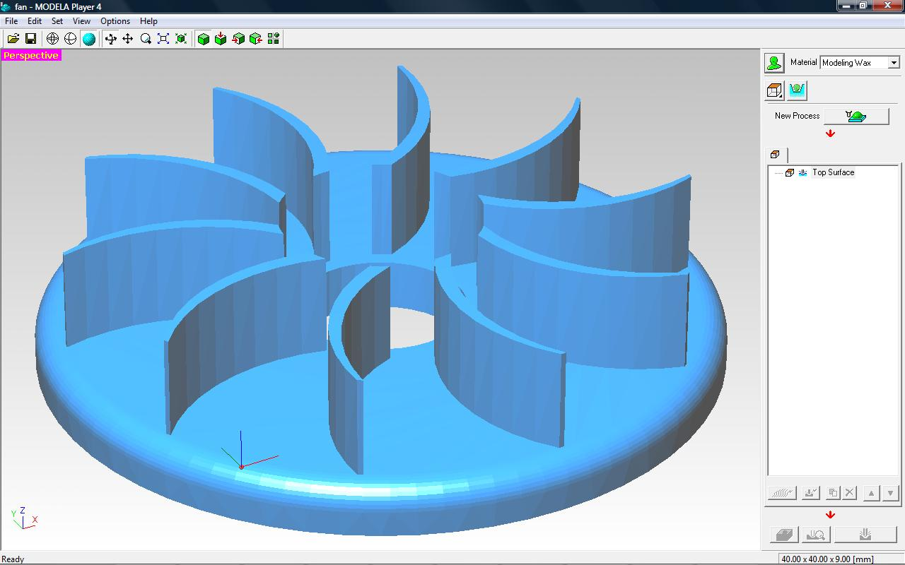

### Theory

Utilization of computers in manufacturing applications has proved to be one of the most significant developments over the last couple of decades in helping to improve the productivity and efficiency of manufacturing systems.

**NUMERICALLY CONTROLLED MACHINE TOOLS:**

An NC machine tool is functionally the same as a conventional machine tool. The technological capabilities NC machine tools in terms of machining are no different from those of conventional ones. The difference is in the way in which the various machine functions and slide movements are controlled.

**The functions and motions such as:**

* turning the spindle on and off
* setting cutting speeds
* setting feed rate
* turning coolant on and off

Moving tool with respect to workpiece are performed by Machine Control Unit (MCU) in NC machine tools.
In CNC (Computer Numerical Control), the instructions are stored as a program in a micro-computer attached to the machine. The computer will also handle much of the control logic of the machine, making it more adaptable than earlier hard-wired controllers.

**CNC APPLICATIONS**

* 2.5D / 3D Machining
* Turning Lathes, Turning Centre
* Milling Machining, Machining Centres

**What is 3D machining?**

2D or 2.5D machining is when all the machining is in the same plane and that plane coincides with one of the planes of the milling machine. For example, a slot drill cuts the part shown above. The cutter plunges into the billet (move in Z) and then cuts the profile with a series of X and Y moves.

Setting tool paths for 2.5D machining is generally simple and quick and a vast range of parts is made this way. Code listings are relatively short and are pre-processed rapidly.

3D Parts

3D machining is when surfaces are cut which lie on different planes and which may be other than the three major planes of the milling machine, for example, the faces of a pyramid or surface of a hemisphere as shown above. 3D machining requires all three axes of the mill to be able to move simultaneously.

Depending on the profile required, slot drills, bull nose or ball ended cutters are used for 3D finish machining. Slot drills or end mills can be used for roughing.

Manual creation of NC code for 3D machining is not a realistic option. The mathematics involved is formidable and a code listing is likely to have many tens of thousands of lines. Use 3D code generating software.
3D machining can take a very long time even on fast, modern machines and especially if a high quality finish is required. A ball-ended cutter leaves parallel rows of cusps over the cut surfaces. To reduce the height of these cusps, the parallel passes of the tool must be closer together. If the distance between passes is halved, the machining time doubles. The diameter of the ball ended cutter comes into the equation too: the smaller the diameter, the greater the number of tool passes.
3D machining takes much longer machining time than 2.5D machining: it can easily run into hours. For this reason it is a good idea to machine materials where high feed rates can be used: for example, high density closed cell rigid modelling foam or modelling wax. However, the highest feed rates do not give the shortest machining time. This is because acceleration/deceleration control is applied to machine movements

**Feed Rates**

Imagine you are to machine a surface which has many curves, lumps and bumps and no horizontal flat areas. The tip of the cutting tool will be constantly changing direction. It will travel very short distances in any given direction, perhaps only a few hundredths of a millimetre. Every time the tool changes direction it will accelerate from zero speed towards the set feed rate. However, before it reaches the set feed rate it has to decelerate and stop for another change of direction. The tool never reaches the set feed rate. The net result is that the actual feed rate of the cutter through the material is very low, perhaps only tens of millimetres per minute rather than the hundreds of millimetres per minute stated in the code.
As a general rule, the higher the feed rate, the great the impact acceleration/deceleration has on the machining time. By choosing a lower feed rate, say 350mm/min rather than 450mm/min, the machining time can be considerably reduced.
If the surface to be machined is predominantly flat and horizontal and with few lumps and bumps, then very high feed rates can be used to do the job quickly. If the surface lacks significant flat, horizontal areas then a lower feed rate will give a shorter machining time.
Feed rates should always be appropriate for the material being machined and the cutter being used.

**Estimated Machining Time**

CADCAM software will often give an estimate of machining time. It calculates this from the total length of the tool paths and the feed rates being used. It cannot take account of the acceleration/deceleration control applied by the machine's control software. Therefore any estimate of machining time must be taken with a pinch of salt. It is best to read it as saying that machining will take longer than the time stated

**Cutters**

The cutters usually used for 3D machining are ball-ended - they are like normal slot drills but, instead of a flat end, these cutters have an hemispherical end. Because 3D machining often involves cutting deep into a thick billet, long-reach cutters may be required. These have a longer flute length than standard cutters.
Whatever type of cutter is used, care must be taken to ensure that, when cutting deep into a thick billet, the shank of the cutter is not being forced through uncut material, even modelling foam. Take account of the flute length of a cutter when planning depths of cut.

[Reference Link Here - https://youtu.be/SWjd4r2Yzvs](https://youtu.be/SWjd4r2Yzvs)
